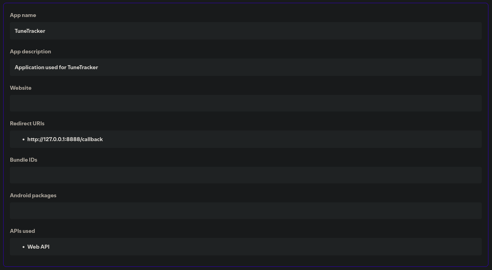
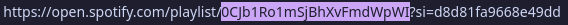

# TuneTracker
A (Work in progress!!) simple commandline tool that imports spotify playlists into subsonic music servers.

## Features

**Currently Implemented**
- Accurately matches tracks across platforms
- Simple commandline interface
- Creates playlists on subsonic servers
- Prompts users for for input for songs that couldn't be matched
- Add spotify songs to favorites instead of creating a new playlist

**Planned**
- Importing of saved tracks instead of playlists
- Downloading of missing songs in flac/mp3 format
- Other platform support (Amazon Music, YouTube Music, Tidal etc) (Maybe)

## Installation
An AUR package for Arch Linux users might be available at some point.

1. Clone the repository

`git clone https://github.com/Funtimes909/TuneTracker`

2. Navigate to the project directory

3. Build a binary with `Cargo`

`cargo build --release`

4. Binary will be available at `/target/release/TuneTracker`

## Usage

**Spotify**

To use this tool, you need to create a spotify application which you can do at the [spotify developer dashboard](https://developer.spotify.com/dashboard). Fill out the required fields and set Redirect URI to `http://127.0.0.1:8888/callback`. At the bottom of the page make sure to select the Web API in the apis used section. Copy the client ID and secret shown at the top and use them as arguments for the program.

The playlist argument takes a spotify playlist id, not a URL. You can get the playlist id by right clicking the playlist and copying the section highlighted below.

**Subsonic**

Provide your subsonic servers URL, username and password as arguments to the program. (eg. --subsonic-url "https://navidrome.example.com" --subsonic-user "LedZeppelinLover67" --subsonic-password "[password here]")

You can also specify if you would like the playlist to be imported to your "Favorites" section on subsonic instead of creating a new playlist, by default it creates a new playlist, but you can add "--destination favorites" for it to import songs to the favorites section instead.

## Contributing
Contributions are welcome, please open a pull request if you wish to submit code. For larger features, please open an issue first to discuss the change

## License
This project is licensed under the [GNU General Public License v3.0](https://www.gnu.org/licenses/gpl-3.0.en.html)